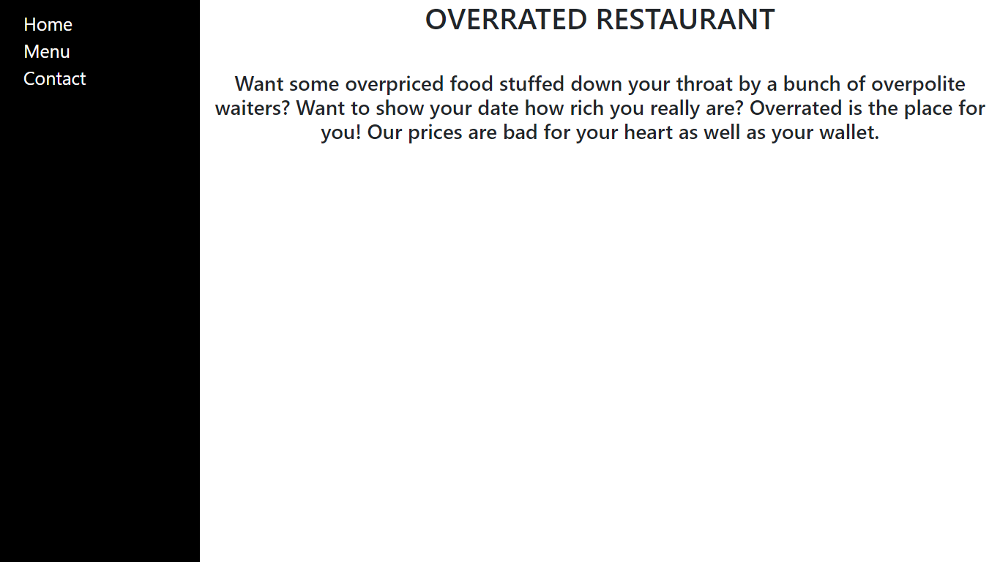

 

# Demo restaurant website built for the javascript module.

> In this project, we were required to build a restaurant website where users can navigate on the other pages using tabs (without redirecting the browser on click).

## App functionality

- Users can visit the home, menu and contact pages

## This web app is live, you can check it here: [Live demo](https://rickcoyl.github.io/Restaurant-Page/dist/index.html)

## Screenshots of the app.

## Built With

- HTML/CSS
- Javascript/ES6
- Webpack
- Bootstrap

## Prerequisities.

To get this project up and running locally, you must clone this repository or download the files and double click on `index.html` found in the `dist` folder.

## Authors

👤 **RICK OBURU**

- Github: [https://github.com/RICKCOYL](https://github.com/RICKCOYL)
- Twitter: [https://twitter.com/rickcoyl](https://twitter.com/rickcoyl)
- Linkedin: [https://www.linkedin.com/in/rick-oburu/](https://www.linkedin.com/in/rick-oburu/)

## 🤝 Contributing

Our favourite contributions are those that help us improve the project, whether with a contribution, an issue, or a feature request!

## Show your support

If you've read this far....give us a ⭐️!
